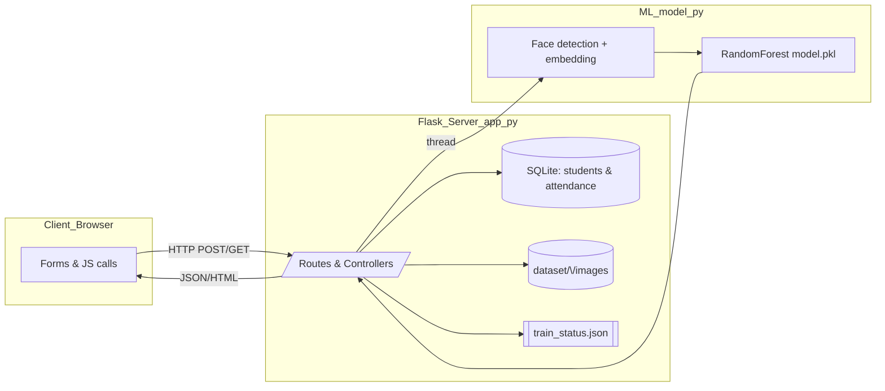

## Project Analysis

### Project Overview
- **Purpose**: Flask-based attendance tracker that leverages facial recognition to automate student check-ins, replacing manual or RFID processes.
- **Main Components**: `app.py` (Flask routes, DB operations, training orchestration), `model.py` (Mediapipe-based embedding + RandomForest utilities), runtime artifacts (`attendance.db`, `dataset/`, `model.pkl`, `train_status.json`), and expected frontend templates/static assets.

### Architecture
- **Layers**
  - Web/API: HTML pages and JSON endpoints (home, add student, mark attendance, stats).
  - Data: SQLite tables `students` and `attendance`, plus per-student image folders.
  - ML: Embedding extraction via Mediapipe and RandomForest classifier stored as `model.pkl`.
  - Background Ops: `/train_model` launches a thread that processes dataset images and emits progress events to `train_status.json`.
- **Responsibilities**
  - `app.py`: initializes DB, handles student CRUD, image uploads, attendance recording, training control, CSV export, and summary APIs.
  - `model.py`: provides `crop_face_and_embed`, `extract_embedding_for_image`, model loading/prediction, and the background training routine.
- **Interaction Diagram**



### System Workflow
1. **Student Registration** (`/add_student` GET/POST)  
   - Inserts metadata into `students` and creates `dataset/<student_id>` for image capture.
2. **Face Capture & Upload** (`/upload_face`)  
   - Receives multiple images, stores them with timestamped filenames in the student's dataset folder.
3. **Model Training** (`/train_model`)  
   - Spawns a background thread (`train_model_background`) that iterates student folders, runs Mediapipe detection, generates 32×32 grayscale embeddings, fits a `RandomForestClassifier`, and saves `model.pkl`. Progress persisted via `train_status.json`.
4. **Recognition & Attendance** (`/recognize_face`)  
   - Accepts an image, extracts embedding, loads `model.pkl`, predicts label + confidence (must be ≥ 0.5). On success, logs attendance row with UTC timestamp.
5. **Monitoring & Reporting**  
   - `/attendance_stats` summarizes last 30 days via pandas, `/attendance_record` renders filterable history, `/download_csv` streams CSV exports, `/students` provides JSON listing and delete operations.

### Setup & Execution
- **Prerequisites**
  - Python 3.9+; OpenCV build requirements (Visual Studio Build Tools on Windows).
- **Install Dependencies**
  ```bash
  python -m venv .venv
  .\.venv\Scripts\activate
  pip install flask numpy opencv-python mediapipe pandas scikit-learn
  ```
- **Database/Data Prep**
  - `attendance.db` and `dataset/` are auto-created on first run; ensure write permissions.
- **Run Locally**
  ```bash
  python app.py
  ```
  Access `http://127.0.0.1:5000`; use provided routes or hook up a JS frontend.
- **Testing**
  - Manual verification via browser or Postman (register dummy students, upload sample faces, train, then call `/recognize_face`).
  - Automated tests not provided; consider adding pytest suites for `model.py` and API endpoints.

### Domain Logic & Rules
- Confidence threshold (`conf >= 0.5`) guards against false positives before marking attendance.
- Student IDs double as classifier labels; dataset directories must match DB IDs.
- Attendance timestamps stored as UTC ISO-8601 strings, supporting daily/weekly/monthly filters.
- Training progress weighted (80% feature extraction, final 20% model fit + completion) to keep UI feedback responsive.
- Deleting a student removes their records and dataset folder to avoid orphaned data.

### Recommendations
- Add missing frontend templates/static assets to ensure routes render correctly.
- Avoid overwriting `train_status.json` if training is mid-flight; gate writes carefully.
- For production, run Flask via WSGI (Gunicorn/uWSGI), disable debug, and move training to a task queue (Celery/RQ).
- Harden DB operations (transactions, error handling) and consider migrating to a more scalable DB if concurrency grows.
